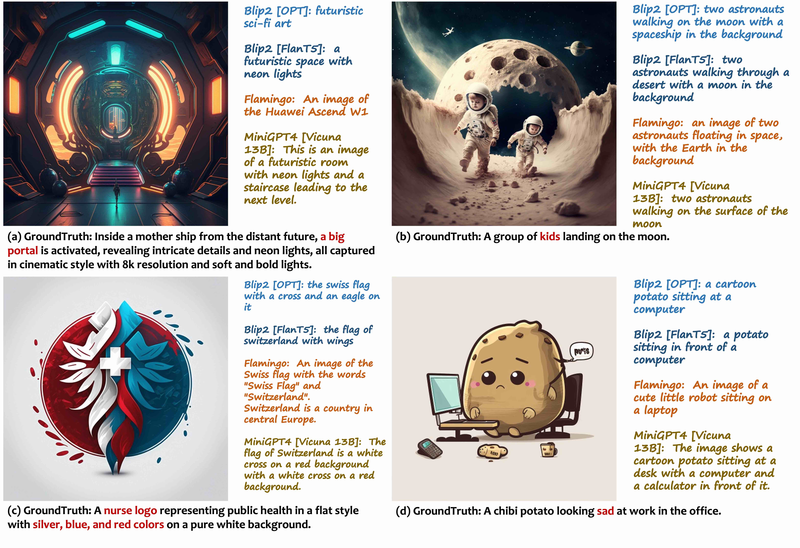
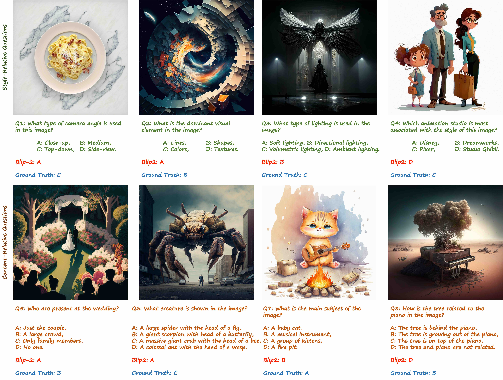

# JourneyDB

[[Project Page]]() [[Paper]]() [[HuggingFace]]() [[OpenDataLab]]()


**JourneyDB** is a large-scale generated image understanding dataset that contains **4,429,295** high-resolution Midjourney images, annotated with corresponding **text prompt**, **image caption** and **visual question answering**.

**JourneyDB** supports **4** downstream tasks, i.e. **Prompt Inversion**, **Style Retrieval**, **Image Caption**, and **Visual Question Answering**.

## Data Samples
We provide several examples to show the contents of each instance of the dataset. For each image instance, we acquire the corresponding text prompts used to generate the images with Midjourney. Furhtermore, we employ the GPT3.5 to generate the caption and VAQ groundtruth.


## Benchmarks
Our dataset supports **4** downstream tasks, i.e. **Prompt Inversion**, **Style Retrieval**, **Image Caption**, and **Visual Question Answering**. We evaluate many existing methods on these tasks and provide a comprehensive benchmark. Please see our [Paper]() for more details.

* **Image Caption.** We show some samples from the validation set of JourneyDB captioning. The examples show the gap between the realistic images and the AI-generated images. And the general visual-language model still need some enhancement to handle generated contents.


* **Visual Question Answering** 
We visualize some results of BLIP-2 for Multiple-Choice Visual Question Answering. The top row shows style-relevant questions and the bottom row shows content-relevant questions. It once again demonstrats the difficulty to handle the generated contents.


## JourneyDB Dataset Downloads

* Mega: [downloading link](https://mega.nz/folder/tYpAVYQT#u0-UvS1rKf2A8-1MNH2waA)
* Baidu Drive: [downloading link]()


* The JourneyDB dataset is available for **non-commercial research purposes** only.
* All images of the JourneyDB dataset are obtained from the Internet which are not property of MMLAB, The Chinese University of Hong Kong. The MMLAB is not responsible for the content nor the meaning of these images.
* You agree **not to** reproduce, duplicate, copy, sell, trade, resell or exploit for any commercial purposes, any portion of the images and any portion of derived data.
* You agree **not to** further copy, publish or distribute any portion of the JourneyDB dataset. Except, for internal use at a single site within the same organization it is allowed to make copies of the dataset.
* The MMLAB reserves the right to terminate your access to the CelebA dataset at any time.

## License and Citation
The use of this software is RESTRICTED to **non-commercial research and educational purposes**.
```
@inproceedings{
}
```
