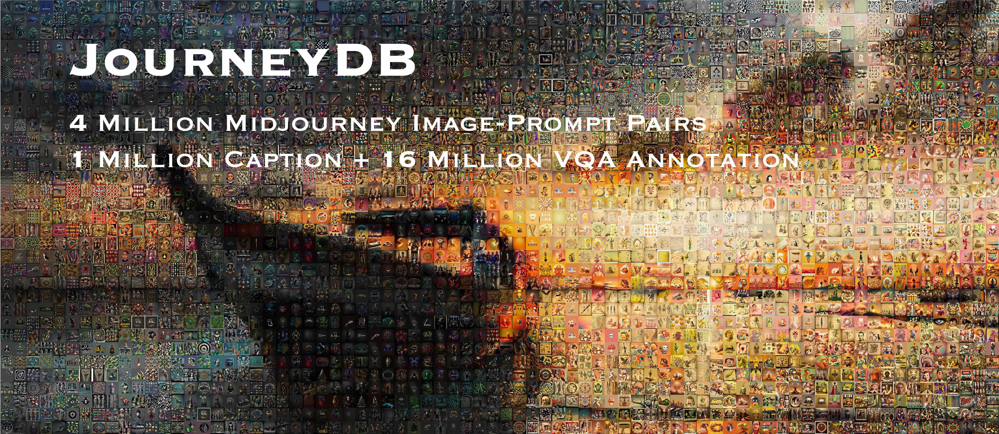
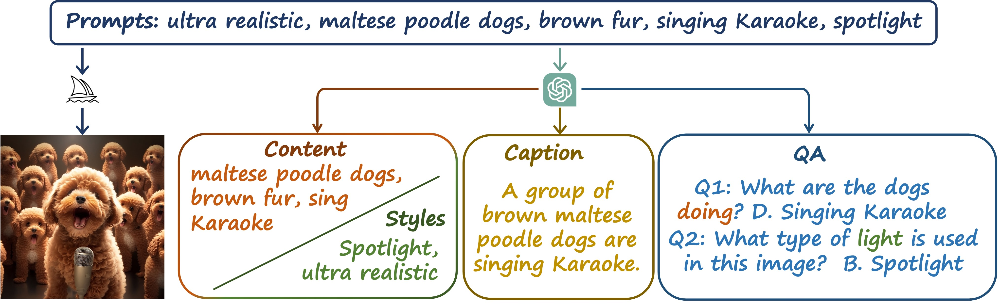
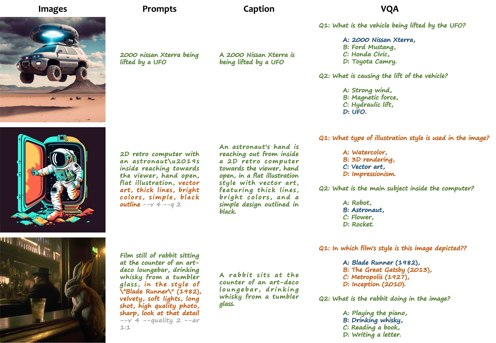

# JourneyDB

[[Project Page]](https://journeydb.github.io) [[Paper]]() [[HuggingFace]](https://huggingface.co/datasets/kqsun/JourneyDB) [[OpenDataLab]]()



## Dataset Description

### Summary

**JourneyDB** is a large-scale generated image understanding dataset that contains **4,429,295** high-resolution Midjourney images, annotated with corresponding **text prompt**, **image caption** and **visual question answering**.

### Supported Tasks

**JourneyDB** supports **4** downstream tasks, i.e. **Prompt Inversion**, **Style Retrieval**, **Image Caption**, and **Visual Question Answering**. We evaluate many existing methods on these tasks and provide a comprehensive benchmark. Please see our [Paper]() for more details.

## Dataset Details

### Data Collection
For each image instance, we acquire the corresponding text prompts used to generate the images with Midjourney. Furhtermore, we employ the GPT3.5 to generate the caption and VAQ groundtruth.


### Data Instances

We provide several examples to show the contents of each instance of the dataset. 


### Data Splits
We provide detailed statistics for each split subset in the following table. We randomly split the whole dataset into roughly 20 : 1 to obtain the training and validation set. The training set contains 4,189,737 labeled images and 1,385,317 labeled prompts. The validation set contains 235,156 images and 82,093 prompts. And we additionally sample a testing set for manual filtering. The testing set contains 5,402 images and 5,171 prompts.

|                |   Image   |   Prompt  | Labeled Image | Labeled Prompt |  Style QA | Content QA |
|----------------|:---------:|:---------:|:-------------:|:--------------:|:---------:|:----------:|
| Training Set   | 4,453,193 | 1,643,375 |   4,189,737   |    1,385,317   | 7,056,394 |  8,775,971 |
| Validation Set |  234,156  |   82,093  |    234,156    |     82,093     |  311,569  |   374,310  |
| Testing Set    |   5,402   |   5,171   |     5,402     |      5,171     |   10,040  |   11,369   |
| Total          | 4,692,751 | 1,730,639 |   4,429,295   |    1,472,581   | 7,378,003 |  9,161,650 |

## Acquirements

### Downloads

Please fill in the [form](https://docs.google.com/forms/d/e/1FAIpQLSeiciK0g0IA46_hFaitRhdpihhpjqt3helJNT68y-C8MfKhiQ/viewform?usp=sf_link) to acquire the download link.

### License

The JourneyDB dataset is available under the customized [Terms of Usage](./assets/Terms_of_Usage.md).

### Citation

```
@inproceedings{
}
```

### Contributions

[Junting Pan](https://junting.github.io)\*, [Keqiang Sun](https://keqiangsun.github.io)\*, [Yuying Ge](https://geyuying.github.io), [Hao Li](https://cpsxhao.github.io), [Haodong Duan](https://kennymckormick.github.io), [Xiaoshi Wu](https://github.com/tgxs002), [Renrui Zhang](https://github.com/ZrrSkywalker), [Aojun Zhou](https://scholar.google.com/citations?user=cC8lXi8AAAAJ&hl=en), [Zipeng Qin](https://www.linkedin.cn/incareer/in/zipeng-bruce-qin-846a65119), [Yi Wang](https://shepnerd.github.io), [Jifeng Dai](https://jifengdai.org), [Yu Qiao](http://mmlab.siat.ac.cn/yuqiao/), [Hongsheng Li](https://www.ee.cuhk.edu.hk/~hsli/)

(\* equal contribution)